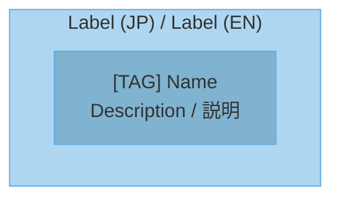

# Architecture Diagram Generator

Generate accurate Mermaid architecture diagrams from repository analysis. Base diagrams on actual files, manifests, routes, models, schemas, dependencies, config, and runtime entry points.

## Workflow

### Step 1: Gather Knowledge From The Repository

Read the project directly. Start with fast structure discovery, then inspect the files that define behavior.

| Information Needed | Files to Check |
|---|---|
| Tech stack | `package.json`, `Cargo.toml`, `go.mod`, `pyproject.toml`, `pom.xml`, `build.gradle` |
| Framework config | `tsconfig.json`, `next.config.js`, `vite.config.*`, `django/settings.py`, `config/*.yml` |
| Infrastructure | `Dockerfile`, `docker-compose.yml`, `k8s/*.yaml`, `.github/workflows/*.yml` |
| API definitions | `openapi.yaml`, `swagger.json`, route/controller files |
| Data models | `schema.prisma`, migrations, `models/*`, `entities/*`, SQL schema files |
| Entry points | `main.*`, `index.*`, `app.*`, `server.*`, CLI command files |
| Dependencies | Import graphs, package manifests, module boundaries, build config |

Cross-check:

1. Compare directory structure with import/dependency relationships.
2. Match routes, commands, jobs, or UI actions to handlers.
3. Verify data flows against models, repositories, queues, APIs, and storage.
4. Mark any uncertain relationship as inferred instead of presenting it as fact.

### Step 2: Select Diagram Types

After choosing diagrams, explain the selection criteria to the user.

#### Step 2-1: プロジェクトタイプを判定

| Type | Characteristics | 判定基準 |
|---|---|---|
| Backend API | HTTPエンドポイント、DB接続、ビジネスロジック | express/fastapi/django等の依存、routes/controllers |
| Full-stack | フロントエンド + バックエンド | frontend/backend構成、またはnext.js/nuxt等 |
| Microservices | 複数サービス、サービス間通信 | docker-compose、k8s、services配下 |
| CLI/Library | コマンドライン、エクスポート | `bin`フィールド、main関数、lib/pkg |
| Desktop App | GUI、ネイティブ | electron, tauri, qt等 |
| Mobile App | iOS/Android | react-native, flutter, swift, kotlin |

#### Step 2-2: プロジェクトサイズを判定

| Size | 目安 | 図の数 |
|---|---|---|
| Small | 少数の主要モジュール、単一アプリ | 2-3 |
| Medium | 複数機能領域、明確な層や境界 | 4-5 |
| Large | 多数のサービス、複雑なデータ/依存関係 | 6-10 |

Use file count, directory boundaries, routes, models, command count, and dependency complexity to estimate size.

#### Step 2-3: 図の種類を選択

| Project Type | Recommended Diagrams |
|---|---|
| Backend API | System Context, Container, Component, Sequence, ER, Deployment |
| Full-stack | System Context, Container, Component, Data Flow, Sequence, ER, Deployment |
| Microservices | Container, Component, Data Flow, Sequence, Deployment, Dependency |
| CLI/Library | Component, Dependency, Data Flow, Sequence |
| Desktop App | System Context, Component, Data Flow, State |
| Mobile App | System Context, Component, Data Flow, State |

#### Step 2-4: ユーザーに判断基準を説明

```markdown
## 図の選択基準

**プロジェクト分析結果:**
- タイプ: [判定したタイプ]
- サイズ: [Small/Medium/Large と根拠]
- 主要モジュール: [上位3-5個]

**選択した図:**
| 図 | 選択理由 |
|---|---|
| [図名] | [理由] |

**選ばなかった図:**
| 図 | 理由 |
|---|---|
| [図名] | [理由] |
```

## Diagram Types

1. **C4 System Context** - System boundary and external actors
2. **C4 Container** - Applications and data stores
3. **Layered Architecture** - Presentation/Application/Domain/Infrastructure layers
4. **Component** - Internal component structure
5. **Data Flow** - Input to Process to Output flow
6. **Sequence** - Time-ordered interactions
7. **ER** - Database entity relationships
8. **State** - State transitions
9. **Deployment** - Infrastructure configuration
10. **Dependency** - Module dependency direction

## Mermaid Rules

Create `.mmd` files with:

- Bilingual labels when helpful: Japanese / English
- Pastel color scheme
- Clear hierarchy using subgraphs for logical grouping
- Actual names from code: modules, files, routes, functions, classes, services, tables
- No emoji in Mermaid files
- Text-based bracket tags instead of emoji

| Good | Bad |
|---|---|
| `[CLI] contrail` | emoji + `contrail` |
| `[API] GitHub` | emoji + `GitHub` |
| `[User] Developer` | emoji + `Developer` |
| `[DB] PostgreSQL` | emoji + `PostgreSQL` |
| `[Agent] CodeGen` | emoji + `CodeGen` |

Template:



## Render PNG Images

Execute the render script:

```bash
python scripts/render_diagrams.py <output_dir> --scale 4
```

Output: `.mmd` files plus high-resolution `.png` images. If `mmdc` is unavailable, keep the Mermaid files and report that PNG rendering was skipped.

## Accuracy Checklist

- [ ] Read manifests and config files.
- [ ] Identify entry points.
- [ ] Identify module boundaries.
- [ ] Verify API routes, commands, jobs, or UI actions.
- [ ] Verify data models before creating ER diagrams.
- [ ] Verify infrastructure files before creating deployment diagrams.
- [ ] Mark inferred relationships clearly.

## Color Guidelines

Use soft pastel colors and readable text. Avoid highly saturated primary colors.

| Layer | Fill Color | Stroke Color | Tags |
|---|---|---|---|
| Entry/Client | `#5D6D7E` | `#4A4D60` | `[User]`, `[CLI]` |
| Presentation | `#F5B7B1` | `#D98880` | `[UI]`, `[Controller]` |
| Application | `#FAD7A0` | `#C68A00` | `[Service]`, `[App]` |
| Service | `#F9E79F` | `#D4AC00` | `[Biz]`, `[Logic]` |
| Domain | `#A9DFBF` | `#52BE80` | `[Entity]`, `[Model]` |
| Data Access | `#A3E4D7` | `#48C9B0` | `[DB]`, `[Repo]` |
| Infrastructure | `#AED6F1` | `#5DADE2` | `[API]`, `[Cloud]` |

## Resources

- `scripts/render_diagrams.py` - Batch render `.mmd` to PNG
- `references/mermaid-patterns.md` - Template patterns for each diagram type
