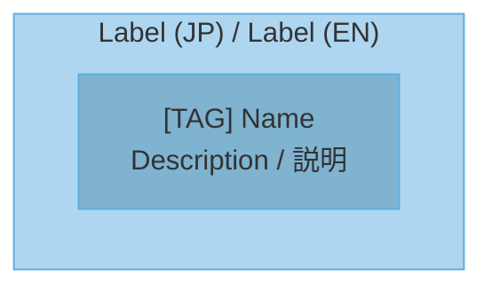

# アーキテクチャ図ジェネレーター

リポジトリ解析から正確な Mermaid アーキテクチャ図を生成します。実際のファイル、マニフェスト、ルート、モデル、スキーマ、依存関係、設定、およびランタイムエントリーポイントをもとに図を作成します。

## ワークフロー

### Step 1: リポジトリから情報を収集する

プロジェクトを直接読み込みます。まず高速な構造探索を行い、次に動作を定義するファイルを調査します。

| 必要な情報 | 確認するファイル |
|---|---|
| 技術スタック | `package.json`, `Cargo.toml`, `go.mod`, `pyproject.toml`, `pom.xml`, `build.gradle` |
| フレームワーク設定 | `tsconfig.json`, `next.config.js`, `vite.config.*`, `django/settings.py`, `config/*.yml` |
| インフラ | `Dockerfile`, `docker-compose.yml`, `k8s/*.yaml`, `.github/workflows/*.yml` |
| API 定義 | `openapi.yaml`, `swagger.json`, ルート/コントローラーファイル |
| データモデル | `schema.prisma`, マイグレーション, `models/*`, `entities/*`, SQL スキーマファイル |
| エントリーポイント | `main.*`, `index.*`, `app.*`, `server.*`, CLI コマンドファイル |
| 依存関係 | インポートグラフ、パッケージマニフェスト、モジュール境界、ビルド設定 |

クロスチェック:

1. ディレクトリ構造とインポート/依存関係を照合する。
2. ルート、コマンド、ジョブ、または UI アクションをハンドラーに対応づける。
3. データフローをモデル、リポジトリ、キュー、API、ストレージと照合して検証する。
4. 不確かな関係は事実として提示せず、推定として明示する。

### Step 2: 図の種類を選択する

図を選択したら、選定基準をユーザーに説明します。

#### Step 2-1: プロジェクトタイプを判定

| Type | Characteristics | 判定基準 |
|---|---|---|
| Backend API | HTTPエンドポイント、DB接続、ビジネスロジック | express/fastapi/django等の依存、routes/controllers |
| Full-stack | フロントエンド + バックエンド | frontend/backend構成、またはnext.js/nuxt等 |
| Microservices | 複数サービス、サービス間通信 | docker-compose、k8s、services配下 |
| CLI/Library | コマンドライン、エクスポート | `bin`フィールド、main関数、lib/pkg |
| Desktop App | GUI、ネイティブ | electron, tauri, qt等 |
| Mobile App | iOS/Android | react-native, flutter, swift, kotlin |

#### Step 2-2: プロジェクトサイズを判定

| Size | 目安 | 図の数 |
|---|---|---|
| Small | 少数の主要モジュール、単一アプリ | 2-3 |
| Medium | 複数機能領域、明確な層や境界 | 4-5 |
| Large | 多数のサービス、複雑なデータ/依存関係 | 6-10 |

ファイル数、ディレクトリ境界、ルート、モデル、コマンド数、依存関係の複雑さを使ってサイズを見積もります。

#### Step 2-3: 図の種類を選択

| Project Type | Recommended Diagrams |
|---|---|
| Backend API | System Context, Container, Component, Sequence, ER, Deployment |
| Full-stack | System Context, Container, Component, Data Flow, Sequence, ER, Deployment |
| Microservices | Container, Component, Data Flow, Sequence, Deployment, Dependency |
| CLI/Library | Component, Dependency, Data Flow, Sequence |
| Desktop App | System Context, Component, Data Flow, State |
| Mobile App | System Context, Component, Data Flow, State |

#### Step 2-4: ユーザーに判断基準を説明

```markdown
## 図の選択基準

**プロジェクト分析結果:**
- タイプ: [判定したタイプ]
- サイズ: [Small/Medium/Large と根拠]
- 主要モジュール: [上位3-5個]

**選択した図:**
| 図 | 選択理由 |
|---|---|
| [図名] | [理由] |

**選ばなかった図:**
| 図 | 理由 |
|---|---|
| [図名] | [理由] |
```

## 図の種類

1. **C4 System Context** - システム境界と外部アクター
2. **C4 Container** - アプリケーションとデータストア
3. **Layered Architecture** - プレゼンテーション/アプリケーション/ドメイン/インフラ層
4. **Component** - 内部コンポーネント構造
5. **Data Flow** - 入力から処理、出力へのフロー
6. **Sequence** - 時系列のインタラクション
7. **ER** - データベースのエンティティ関係
8. **State** - 状態遷移
9. **Deployment** - インフラ構成
10. **Dependency** - モジュール依存の方向

## Mermaid ルール

`.mmd` ファイルを以下の方針で作成します:

- 必要に応じてバイリンガルラベルを使用: 日本語 / 英語
- パステルカラースキーム
- サブグラフを使った明確な階層で論理的なグルーピング
- コードに登場する実際の名前: モジュール、ファイル、ルート、関数、クラス、サービス、テーブル
- Mermaid ファイル内に絵文字を使用しない
- 絵文字の代わりにテキストベースのブラケットタグを使用

| 良い例 | 悪い例 |
|---|---|
| `[CLI] contrail` | 絵文字 + `contrail` |
| `[API] GitHub` | 絵文字 + `GitHub` |
| `[User] Developer` | 絵文字 + `Developer` |
| `[DB] PostgreSQL` | 絵文字 + `PostgreSQL` |
| `[Agent] CodeGen` | 絵文字 + `CodeGen` |

テンプレート:



## PNG 画像のレンダリング

レンダースクリプトを実行します:

```bash
python scripts/render_diagrams.py <output_dir> --scale 4
```

出力: `.mmd` ファイルと高解像度 `.png` 画像。`mmdc` が利用できない場合は Mermaid ファイルを保持し、PNG レンダリングをスキップした旨を報告します。

## 正確性チェックリスト

- [ ] マニフェストと設定ファイルを読む。
- [ ] エントリーポイントを特定する。
- [ ] モジュール境界を特定する。
- [ ] API ルート、コマンド、ジョブ、または UI アクションを検証する。
- [ ] ER 図を作成する前にデータモデルを検証する。
- [ ] デプロイメント図を作成する前にインフラファイルを検証する。
- [ ] 推定した関係を明確にマークする。

## カラーガイドライン

柔らかいパステルカラーと読みやすいテキストを使用します。彩度の高い原色は避けます。

| レイヤー | 塗りつぶし色 | 枠線色 | タグ |
|---|---|---|---|
| Entry/Client | `#5D6D7E` | `#4A4D60` | `[User]`, `[CLI]` |
| Presentation | `#F5B7B1` | `#D98880` | `[UI]`, `[Controller]` |
| Application | `#FAD7A0` | `#C68A00` | `[Service]`, `[App]` |
| Service | `#F9E79F` | `#D4AC00` | `[Biz]`, `[Logic]` |
| Domain | `#A9DFBF` | `#52BE80` | `[Entity]`, `[Model]` |
| Data Access | `#A3E4D7` | `#48C9B0` | `[DB]`, `[Repo]` |
| Infrastructure | `#AED6F1` | `#5DADE2` | `[API]`, `[Cloud]` |

## リソース

- `scripts/render_diagrams.py` - `.mmd` を PNG に一括レンダリング
- `references/mermaid-patterns.md` - 各図の種類のテンプレートパターン
