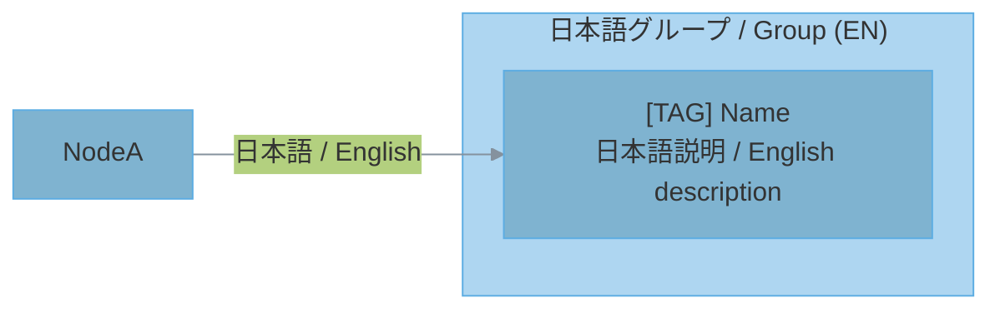

# SysViz - Project Architecture Diagram Generator

diagram スキルの保存先変更版。生成した Mermaid 図を `~/.contrail/sysviz/projects/<project-id>/diagrams/` に保存する。

## Output Location

MMD ファイルは以下に保存する:

```
/home/mizuki2/.contrail/sysviz/projects/<project-id>/diagrams/*.mmd
```

### project-id の決定

1. **リポジトリ名**を優先: `git -C <対象ディレクトリ> rev-parse --show-toplevel` からディレクトリ名を取得
2. リポジトリでなければ**カレントディレクトリ名**を使用
3. project-id は小文字・ハイフン区切りに正規化（スペースやアンダースコアはハイフンに）

### manifest.json (任意)

プロジェクト表示名をきれいにしたい場合は `manifest.json` を置く:

```
/home/mizuki2/.contrail/sysviz/projects/my-service/manifest.json
```

```json
{
  "id": "my-service",
  "label": "My Service",
  "repoRoot": "/home/mizuki2/dev/my-service"
}
```

既に manifest.json が存在すれば id を読み取って project-id として使う。

### 保存前の準備

```bash
PROJECT_ID=$(git rev-parse --show-toplevel 2>/dev/null | xargs basename | tr ' _' '--' || basename "$(pwd)" | tr ' _' '--')
OUTPUT_DIR="/home/mizuki2/.contrail/sysviz/projects/${PROJECT_ID}/diagrams"
mkdir -p "${OUTPUT_DIR}"
```

## Workflow

### Step 1: Gather Knowledge From The Repository

Read the project directly. Start with fast structure discovery, then inspect the files that define behavior.

| Information Needed | Files to Check |
|---|---|
| Tech stack | `package.json`, `Cargo.toml`, `go.mod`, `pyproject.toml`, `pom.xml`, `build.gradle` |
| Framework config | `tsconfig.json`, `next.config.js`, `vite.config.*`, `django/settings.py`, `config/*.yml` |
| Infrastructure | `Dockerfile`, `docker-compose.yml`, `k8s/*.yaml`, `.github/workflows/*.yml` |
| API definitions | `openapi.yaml`, `swagger.json`, route/controller files |
| Data models | `schema.prisma`, migrations, `models/*`, `entities/*`, SQL schema files |
| Entry points | `main.*`, `index.*`, `app.*`, `server.*`, CLI command files |
| Dependencies | Import graphs, package manifests, module boundaries, build config |

Cross-check:

1. Compare directory structure with import/dependency relationships.
2. Match routes, commands, jobs, or UI actions to handlers.
3. Verify data flows against models, repositories, queues, APIs, and storage.
4. Mark any uncertain relationship as inferred instead of presenting it as fact.

### Step 2: Select Diagram Types

After choosing diagrams, explain the selection criteria to the user.

#### Step 2-1: プロジェクトタイプを判定

| Type | Characteristics | 判定基準 |
|---|---|---|
| Backend API | HTTPエンドポイント、DB接続、ビジネスロジック | express/fastapi/django等の依存、routes/controllers |
| Full-stack | フロントエンド + バックエンド | frontend/backend構成、またはnext.js/nuxt等 |
| Microservices | 複数サービス、サービス間通信 | docker-compose、k8s、services配下 |
| CLI/Library | コマンドライン、エクスポート | `bin`フィールド、main関数、lib/pkg |
| Desktop App | GUI、ネイティブ | electron, tauri, qt等 |
| Mobile App | iOS/Android | react-native, flutter, swift, kotlin |

#### Step 2-2: プロジェクトサイズを判定

| Size | 目安 | 図の数 |
|---|---|---|
| Small | 少数の主要モジュール、単一アプリ | 2-3 |
| Medium | 複数機能領域、明確な層や境界 | 4-5 |
| Large | 多数のサービス、複雑なデータ/依存関係 | 6-10 |

Use file count, directory boundaries, routes, models, command count, and dependency complexity to estimate size.

#### Step 2-3: 図の種類を選択

| Project Type | Recommended Diagrams |
|---|---|
| Backend API | System Context, Container, Component, ER, Deployment |
| Full-stack | System Context, Container, Component, Data Flow, ER, Deployment |
| Microservices | Container, Component, Data Flow, Deployment, Dependency |
| CLI/Library | Component, Dependency, Data Flow |
| Desktop App | System Context, Component, Data Flow, State |
| Mobile App | System Context, Component, Data Flow, State |

#### Step 2-4: ユーザーに判断基準を説明

```markdown
## 図の選択基準

**プロジェクト分析結果:**
- タイプ: [判定したタイプ]
- サイズ: [Small/Medium/Large と根拠]
- 主要モジュール: [上位3-5個]

**選択した図:**
| 図 | 選択理由 |
|---|---|
| [図名] | [理由] |

**選ばなかった図:**
| 図 | 理由 |
|---|---|
| [図名] | [理由] |

**保存先:** `/home/mizuki2/.contrail/sysviz/projects/<project-id>/diagrams/`
```

## Diagram Types

1. **C4 System Context** - System boundary and external actors
2. **C4 Container** - Applications and data stores
3. **Layered Architecture** - Presentation/Application/Domain/Infrastructure layers
4. **Component** - Internal component structure
5. **Data Flow** - Input to Process to Output flow
6. **ER** - Database entity relationships
7. **State** - State transitions
8. **Deployment** - Infrastructure configuration
9. **Dependency** - Module dependency direction

## Mermaid Rules

Create `.mmd` files with:

- **ALL labels MUST be bilingual: Japanese / English** — no exceptions
- **Default layout: `LR` (left-to-right)** — diagrams are viewed on widescreen monitors; optimize for horizontal width, not vertical depth
- Pastel color scheme
- Clear hierarchy using subgraphs for logical grouping
- Actual names from code: modules, files, routes, functions, classes, services, tables
- No emoji in Mermaid files
- Text-based bracket tags instead of emoji

### Layout Direction Rules (レイアウト方向規則)

Diagrams are primarily viewed on widescreen monitors. Optimize for horizontal layout.

| Direction | When to use | Diagram types |
|---|---|---|
| `LR` (default) | General flow, data flow, dependencies, system context | System Context, Component, Data Flow, Dependency, ER |
| `TB` / `BT` | Only when the diagram represents inherently vertical relationships (inheritance, layering) | Layered Architecture, Class Hierarchy |

**Key principle:** If in doubt, use `LR`. A diagram that is slightly too wide is always better than one that is too tall.

| Good | Bad |
|---|---|
| `[CLI] contrail<br/>CLIツール / CLI tool` | emoji + `contrail` (English only / 英語のみ) |
| `[API] GitHub<br/>API連携 / API integration` | emoji + `GitHub` (English only / 英語のみ) |
| `[User] Developer<br/>開発者 / Developer` | emoji + `Developer` (English only / 英語のみ) |
| `[DB] PostgreSQL<br/>データベース / Database` | emoji + `PostgreSQL` (English only / 英語のみ) |
| `[Agent] CodeGen<br/>コード生成 / Code Generator` | emoji + `CodeGen` (English only / 英語のみ) |

### Bilingual Format Rules (二言語フォーマット規則)

ALL elements in every `.mmd` file — subgraphs, nodes, and edges — MUST include both Japanese and English. No element is exempt.

#### Subgraph labels (サブグラフ)

```
subgraph Group["日本語 / English"]
```

#### Node labels (ノード)

```
Node["[TAG] Name<br/>日本語説明 / English description"]
```

When the tag itself has a natural Japanese equivalent, include it:

```
Node["[TAG / 日本語タグ] Name<br/>日本語説明 / English description"]
```

#### Edge labels (エッジ)

```
A -->|"日本語 / English"| B
```

#### Templates (テンプレート)

**Flowchart:**



## Step 3: Save Diagrams

すべての `.mmd` ファイルを上記 Output Location に保存する。

ファイル命名規則:
```
01_system_context.mmd
02_container_view.mmd
03_component_view.mmd
04_data_flow.mmd
05_er_diagram.mmd
06_state_diagram.mmd
07_deployment.mmd
08_dependency.mmd
```

**重要:** `.mmd` ファイルは対象プロジェクトのディレクトリではなく、必ず `~/.contrail/sysviz/projects/<project-id>/diagrams/` に保存すること。

## Render PNG Images

```bash
python /home/mizuki2/.claude/skills/diagram/scripts/render_diagrams.py <output_dir> --scale 4
```

Output: `.mmd` files plus high-resolution `.png` images. If `mmdc` is unavailable, keep the Mermaid files and report that PNG rendering was skipped.

## Accuracy Checklist

- [ ] Read manifests and config files.
- [ ] Identify entry points.
- [ ] Identify module boundaries.
- [ ] Verify API routes, commands, jobs, or UI actions.
- [ ] Verify data models before creating ER diagrams.
- [ ] Verify infrastructure files before creating deployment diagrams.
- [ ] Mark inferred relationships clearly.
- [ ] **Bilingual check:** Every subgraph, node, and edge contains both Japanese and English. No element is English-only.

## Color Guidelines

Use soft pastel colors and readable text. Avoid highly saturated primary colors.

| Layer | Fill Color | Stroke Color | Tags |
|---|---|---|---|
| Entry/Client | `#5D6D7E` | `#4A4D60` | `[User]`, `[CLI]` |
| Presentation | `#F5B7B1` | `#D98880` | `[UI]`, `[Controller]` |
| Application | `#FAD7A0` | `#C68A00` | `[Service]`, `[App]` |
| Service | `#F9E79F` | `#D4AC00` | `[Biz]`, `[Logic]` |
| Domain | `#A9DFBF` | `#52BE80` | `[Entity]`, `[Model]` |
| Data Access | `#A3E4D7` | `#48C9B0` | `[DB]`, `[Repo]` |
| Infrastructure | `#AED6F1` | `#5DADE2` | `[API]`, `[Cloud]` |

## Resources

- `../diagram/scripts/render_diagrams.py` - Batch render `.mmd` to PNG
- `../diagram/references/mermaid-patterns.md` - Template patterns for each diagram type
