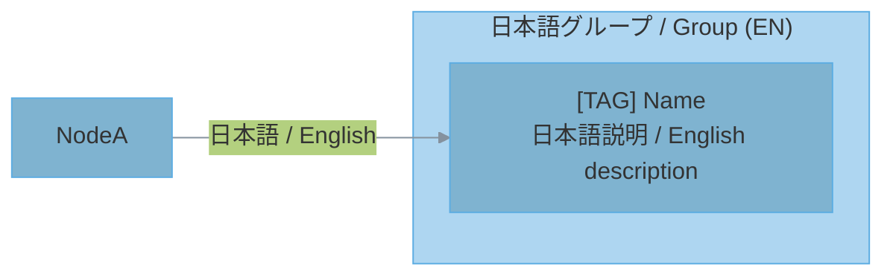

# SysViz - プロジェクトアーキテクチャ図ジェネレーター

diagram スキルの保存先変更版。生成した Mermaid 図を `~/.contrail/sysviz/projects/<project-id>/diagrams/` に保存する。

## 出力先

MMD ファイルは以下に保存する:

```
/home/mizuki2/.contrail/sysviz/projects/<project-id>/diagrams/*.mmd
```

### project-id の決定

1. **リポジトリ名**を優先: `git -C <対象ディレクトリ> rev-parse --show-toplevel` からディレクトリ名を取得
2. リポジトリでなければ**カレントディレクトリ名**を使用
3. project-id は小文字・ハイフン区切りに正規化（スペースやアンダースコアはハイフンに）

### manifest.json (任意)

プロジェクト表示名をきれいにしたい場合は `manifest.json` を置く:

```
/home/mizuki2/.contrail/sysviz/projects/my-service/manifest.json
```

```json
{
  "id": "my-service",
  "label": "My Service",
  "repoRoot": "/home/mizuki2/dev/my-service"
}
```

既に manifest.json が存在すれば id を読み取って project-id として使う。

### 保存前の準備

```bash
PROJECT_ID=$(git rev-parse --show-toplevel 2>/dev/null | xargs basename | tr ' _' '--' || basename "$(pwd)" | tr ' _' '--')
OUTPUT_DIR="/home/mizuki2/.contrail/sysviz/projects/${PROJECT_ID}/diagrams"
mkdir -p "${OUTPUT_DIR}"
```

## ワークフロー

### Step 1: リポジトリから情報を収集する

プロジェクトを直接読み込む。まず高速な構造探索を行い、次に振る舞いを定義するファイルを調査する。

| 必要な情報 | 確認するファイル |
|---|---|
| 技術スタック | `package.json`, `Cargo.toml`, `go.mod`, `pyproject.toml`, `pom.xml`, `build.gradle` |
| フレームワーク設定 | `tsconfig.json`, `next.config.js`, `vite.config.*`, `django/settings.py`, `config/*.yml` |
| インフラ | `Dockerfile`, `docker-compose.yml`, `k8s/*.yaml`, `.github/workflows/*.yml` |
| API定義 | `openapi.yaml`, `swagger.json`, route/controllerファイル |
| データモデル | `schema.prisma`, migrations, `models/*`, `entities/*`, SQLスキーマファイル |
| エントリポイント | `main.*`, `index.*`, `app.*`, `server.*`, CLIコマンドファイル |
| 依存関係 | importグラフ、パッケージマニフェスト、モジュール境界、ビルド設定 |

クロスチェック:

1. ディレクトリ構造とimport/依存関係を照合する。
2. ルート・コマンド・ジョブ・UIアクションをハンドラーと対応付ける。
3. データフローをモデル・リポジトリ・キュー・API・ストレージと照合する。
4. 不確かな関係は事実として提示せず、推定であることを明示する。

### Step 2: 図の種類を選択する

図を選択したら、選択基準をユーザーに説明する。

#### Step 2-1: プロジェクトタイプを判定

| Type | Characteristics | 判定基準 |
|---|---|---|
| Backend API | HTTPエンドポイント、DB接続、ビジネスロジック | express/fastapi/django等の依存、routes/controllers |
| Full-stack | フロントエンド + バックエンド | frontend/backend構成、またはnext.js/nuxt等 |
| Microservices | 複数サービス、サービス間通信 | docker-compose、k8s、services配下 |
| CLI/Library | コマンドライン、エクスポート | `bin`フィールド、main関数、lib/pkg |
| Desktop App | GUI、ネイティブ | electron, tauri, qt等 |
| Mobile App | iOS/Android | react-native, flutter, swift, kotlin |

#### Step 2-2: プロジェクトサイズを判定

| Size | 目安 | 図の数 |
|---|---|---|
| Small | 少数の主要モジュール、単一アプリ | 2-3 |
| Medium | 複数機能領域、明確な層や境界 | 4-5 |
| Large | 多数のサービス、複雑なデータ/依存関係 | 6-10 |

ファイル数・ディレクトリ境界・ルート・モデル・コマンド数・依存関係の複雑さを元にサイズを推定する。

#### Step 2-3: 図の種類を選択

| Project Type | Recommended Diagrams |
|---|---|
| Backend API | System Context, Container, Component, ER, Deployment |
| Full-stack | System Context, Container, Component, Data Flow, ER, Deployment |
| Microservices | Container, Component, Data Flow, Deployment, Dependency |
| CLI/Library | Component, Dependency, Data Flow |
| Desktop App | System Context, Component, Data Flow, State |
| Mobile App | System Context, Component, Data Flow, State |

#### Step 2-4: ユーザーに判断基準を説明

```markdown
## 図の選択基準

**プロジェクト分析結果:**
- タイプ: [判定したタイプ]
- サイズ: [Small/Medium/Large と根拠]
- 主要モジュール: [上位3-5個]

**選択した図:**
| 図 | 選択理由 |
|---|---|
| [図名] | [理由] |

**選ばなかった図:**
| 図 | 理由 |
|---|---|
| [図名] | [理由] |

**保存先:** `/home/mizuki2/.contrail/sysviz/projects/<project-id>/diagrams/`
```

## 図の種類

1. **C4 System Context** - システム境界と外部アクター
2. **C4 Container** - アプリケーションとデータストア
3. **Layered Architecture** - プレゼンテーション/アプリケーション/ドメイン/インフラ層
4. **Component** - 内部コンポーネント構造
5. **Data Flow** - 入力→処理→出力のフロー
6. **ER** - データベースのエンティティ関係
7. **State** - 状態遷移
8. **Deployment** - インフラ構成
9. **Dependency** - モジュールの依存方向

## Mermaid ルール

`.mmd` ファイルを以下の規則で作成する:

- **すべてのラベルは日本語/英語の二言語表記必須** — 例外なし
- **デフォルトレイアウト: `LR` (左から右)** — ワイドスクリーンモニターで閲覧するため、垂直方向ではなく水平方向を最適化する
- パステルカラースキーム
- サブグラフを使った明確な階層による論理的グルーピング
- コードに基づく実際の名前: モジュール・ファイル・ルート・関数・クラス・サービス・テーブル
- Mermaidファイル内に絵文字を使わない
- 絵文字の代わりにテキストのブラケットタグを使用

### Layout Direction Rules (レイアウト方向規則)

図は主にワイドスクリーンモニターで閲覧される。水平レイアウトを最適化すること。

| 方向 | 使用場面 | 図の種類 |
|---|---|---|
| `LR` (デフォルト) | 一般的なフロー、データフロー、依存関係、システムコンテキスト | System Context, Component, Data Flow, Dependency, ER |
| `TB` / `BT` | 本質的に垂直な関係（継承、レイヤリング）を表す場合のみ | Layered Architecture, Class Hierarchy |

**基本原則:** 迷ったら `LR` を使う。少し横に広がりすぎる図は、縦に長すぎる図より常に優れている。

| Good | Bad |
|---|---|
| `[CLI] contrail<br/>CLIツール / CLI tool` | emoji + `contrail` (English only / 英語のみ) |
| `[API] GitHub<br/>API連携 / API integration` | emoji + `GitHub` (English only / 英語のみ) |
| `[User] Developer<br/>開発者 / Developer` | emoji + `Developer` (English only / 英語のみ) |
| `[DB] PostgreSQL<br/>データベース / Database` | emoji + `PostgreSQL` (English only / 英語のみ) |
| `[Agent] CodeGen<br/>コード生成 / Code Generator` | emoji + `CodeGen` (English only / 英語のみ) |

### Bilingual Format Rules (二言語フォーマット規則)

すべての `.mmd` ファイルのすべての要素（サブグラフ・ノード・エッジ）に日本語と英語を両方含めること。例外となる要素はない。

#### Subgraph labels (サブグラフ)

```
subgraph Group["日本語 / English"]
```

#### Node labels (ノード)

```
Node["[TAG] Name<br/>日本語説明 / English description"]
```

タグ自体に自然な日本語訳がある場合は含める:

```
Node["[TAG / 日本語タグ] Name<br/>日本語説明 / English description"]
```

#### Edge labels (エッジ)

```
A -->|"日本語 / English"| B
```

#### Templates (テンプレート)

**フローチャート:**



## Step 3: Save Diagrams

すべての `.mmd` ファイルを上記 Output Location に保存する。

ファイル命名規則:
```
01_system_context.mmd
02_container_view.mmd
03_component_view.mmd
04_data_flow.mmd
05_er_diagram.mmd
06_state_diagram.mmd
07_deployment.mmd
08_dependency.mmd
```

**重要:** `.mmd` ファイルは対象プロジェクトのディレクトリではなく、必ず `~/.contrail/sysviz/projects/<project-id>/diagrams/` に保存すること。

## PNG画像のレンダリング

```bash
python /home/mizuki2/.claude/skills/diagram/scripts/render_diagrams.py <output_dir> --scale 4
```

出力: `.mmd` ファイルと高解像度の `.png` 画像。`mmdc` が利用できない場合は Mermaid ファイルを保持し、PNG レンダリングをスキップした旨を報告する。

## 精度チェックリスト

- [ ] マニフェストと設定ファイルを読む。
- [ ] エントリポイントを特定する。
- [ ] モジュール境界を特定する。
- [ ] APIルート・コマンド・ジョブ・UIアクションを検証する。
- [ ] ER図を作成する前にデータモデルを検証する。
- [ ] デプロイメント図を作成する前にインフラファイルを検証する。
- [ ] 推定関係を明確に示す。
- [ ] **二言語チェック:** すべてのサブグラフ・ノード・エッジに日本語と英語を含める。英語のみの要素があってはならない。

## カラーガイドライン

柔らかいパステルカラーと読みやすいテキストを使用する。高彩度の原色は避ける。

| Layer | Fill Color | Stroke Color | Tags |
|---|---|---|---|
| Entry/Client | `#5D6D7E` | `#4A4D60` | `[User]`, `[CLI]` |
| Presentation | `#F5B7B1` | `#D98880` | `[UI]`, `[Controller]` |
| Application | `#FAD7A0` | `#C68A00` | `[Service]`, `[App]` |
| Service | `#F9E79F` | `#D4AC00` | `[Biz]`, `[Logic]` |
| Domain | `#A9DFBF` | `#52BE80` | `[Entity]`, `[Model]` |
| Data Access | `#A3E4D7` | `#48C9B0` | `[DB]`, `[Repo]` |
| Infrastructure | `#AED6F1` | `#5DADE2` | `[API]`, `[Cloud]` |

## リソース

- `../diagram/scripts/render_diagrams.py` - `.mmd` を PNG に一括レンダリング
- `../diagram/references/mermaid-patterns.md` - 各図の種類のテンプレートパターン
